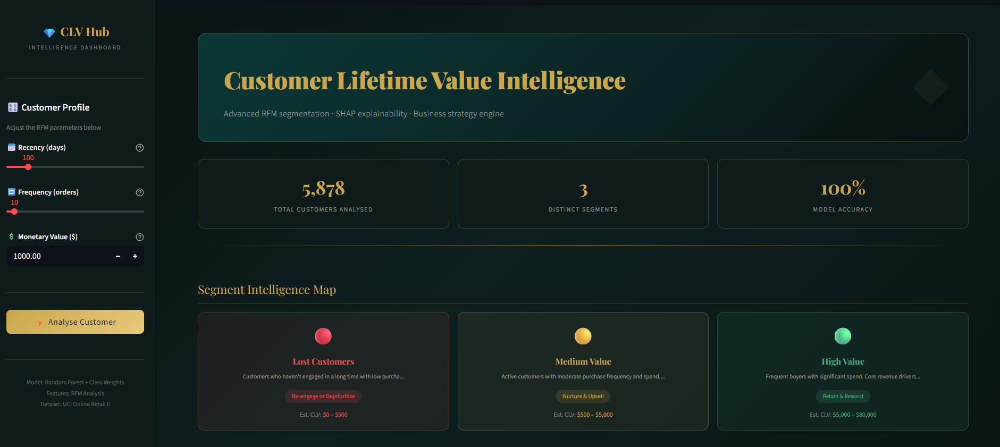
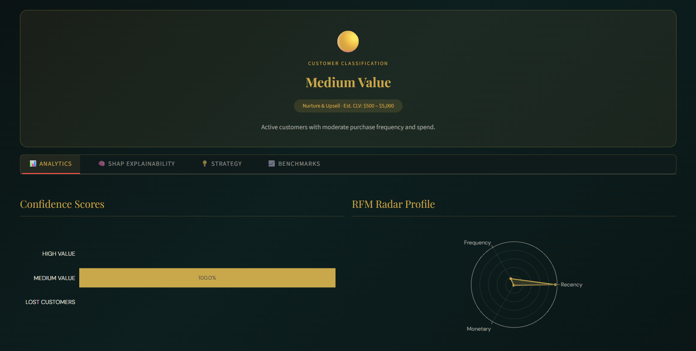
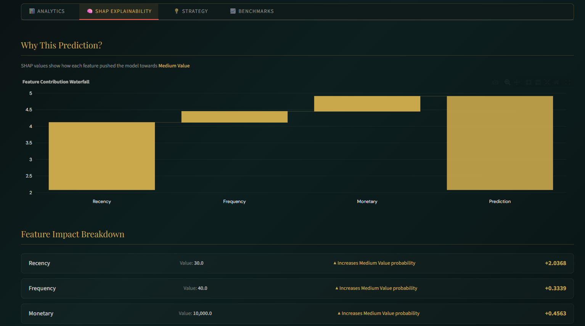
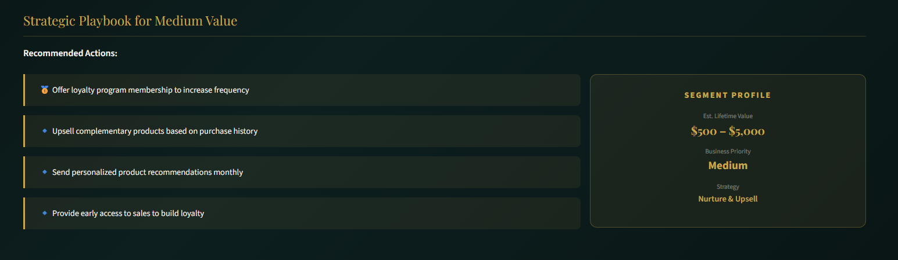
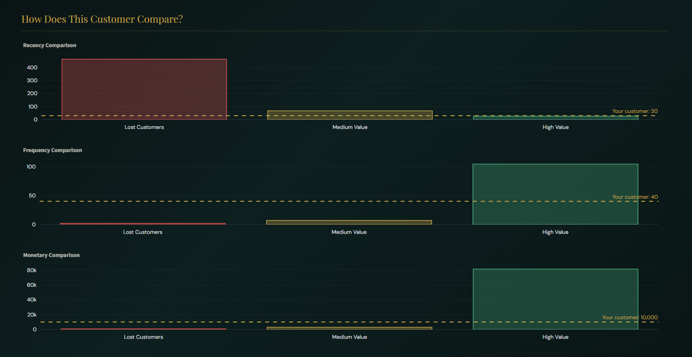

# 💎 Customer Lifetime Value Intelligence Hub

> An end-to-end Machine Learning system that segments customers by lifetime value using RFM feature engineering, SHAP explainability, and an interactive business intelligence dashboard — deployed live on Streamlit Cloud.

---

## 📌 Project Overview

Customer Lifetime Value (CLV) prediction is one of the most critical capabilities in modern CRM and retention strategy. This project builds a full ML pipeline that:

- Engineers RFM (Recency, Frequency, Monetary) features from raw transactional data
- Segments 5,878 customers into 3 behavioural groups using KMeans clustering
- Trains a Random Forest classifier with class-weight balancing
- Explains every prediction using SHAP (SHapley Additive exPlanations)
- Delivers actionable business recommendations per customer segment
- Presents everything through a dark-themed, production-grade Streamlit dashboard

---

## ❗ Problem Statement

In retail and e-commerce, not all customers are equal. Businesses that treat a one-time buyer the same as a loyal champion waste marketing budget and lose revenue.

**Key facts:**
- Acquiring a new customer costs **5–7× more** than retaining an existing one
- The top **20% of customers** typically generate **80% of revenue** (Pareto Principle)
- Without CLV segmentation, retention campaigns have no targeting strategy

**Goal:** Build an intelligent system that identifies which segment a customer belongs to based on their purchase behaviour — and recommend the right business action for each.

---

## 🏗️ System Architecture

```
Raw Transaction Data (UCI Online Retail II)
         │
         ▼
┌─────────────────────┐
│   Data Cleaning     │  Remove duplicates, nulls, cancelled orders
└────────┬────────────┘
         │
         ▼
┌─────────────────────┐
│  Feature Engineering│  RFM: Recency · Frequency · Monetary
└────────┬────────────┘
         │
         ▼
┌─────────────────────┐
│  KMeans Clustering  │  Elbow method → 4 optimal segments
└────────┬────────────┘
         │
         ▼
┌─────────────────────┐
│  Classification     │  Random Forest + SMOTE for imbalance
└────────┬────────────┘
         │
         ▼
┌─────────────────────┐
│  SHAP Explainability│  Feature-level prediction reasoning
└────────┬────────────┘
         │
         ▼
┌─────────────────────┐
│  Streamlit Dashboard│  Live interactive business intelligence
└─────────────────────┘
```

---

## 🛠️ Tech Stack

| Layer | Technology                           |
|-------|--------------------------------------|
| Language | Python 3.10+                          |
| Data Processing | Pandas, NumPy                        |
| Machine Learning | Scikit-learn (KMeans, Random Forest) |
| Imbalance Handling | Class Weight Balancing             |
| Explainability | SHAP                                 |
| Visualisation | Plotly, Matplotlib, Seaborn          |
| Dashboard | Streamlit                            |
| Model Persistence | Joblib                               |
| Version Control | Git & GitHub                         |
| Deployment | Streamlit Cloud                      |

---

## 🔬 Feature Engineering — RFM Analysis

RFM is an industry-standard customer analytics framework used by companies like Amazon, Netflix, and Spotify.

| Feature | Definition               | Business Signal |
|---------|--------------------------|-----------------|
| **Recency** | Days since last purchase | Lower = more engaged |
| **Frequency** | Number of unique orders  | Higher = more loyal |
| **Monetary** | Total amount spent ($)   | Higher = more valuable |

These 3 features are computed directly from raw transaction logs — no pre-built features used. This mirrors real-world feature engineering workflows.

---

## 🎯 Customer Segments

After applying KMeans clustering (k=3, determined via Elbow Method):

| Segment | Recency | Frequency | Monetary | Est. CLV | Strategy |
|---------|---------|-----------|----------|----------|----------|
| 🔴 Lost Customers | ~462 days | ~2 orders | ~$749    | $0–$500  | Re-engage or deprioritize |
| 🟡 Medium Value | ~67 days | ~7 orders | ~$2,949  | $500–$5K | Nurture & upsell |
| 🟢 High Value | ~26 days | ~104 orders | ~$81,356 | $5K–$80K | Retain & reward |

---

## 🤖 Model Performance

### Random Forest + Class Weight Balancing 


| Metric | 3-Cluster Model |
|--------|----------------|
| Lost Customers F1 | 0.97 |
| Medium Value F1 | 0.96 |
| High Value F1 | 0.93 |
| **Macro F1** | 0.95 |
| **Overall Accuracy** | 0.97 |
---

## 🧠 SHAP Explainability

Every prediction in this system is explainable. SHAP values show exactly which features drove a customer's segment classification and by how much.

### Example — Lost Customer:
- High Recency → **strongly pushes towards Lost** (hasn't bought in months)
- Low Frequency → **confirms Lost classification**
- Monetary has minimal impact on this segment

This transforms the model from a black box into an **interpretable business tool** that non-technical stakeholders can trust and act on.

---

## 📸 Application Screenshots

### 🖥️ Intelligence Dashboard


### 📊 Prediction & Confidence Scores


### 🧠 SHAP Waterfall Explanation


### 💡 Business Strategy Playbook


### 📈 Benchmarking


---

## 🌐 Live Demo

👉 **Try the app live:** https://your-clv-app.streamlit.app/

---

## 📂 Project Structure

```
clv-prediction/
├── data/
│   └── online_retail_II.csv        # UCI Online Retail II dataset
├── models/
│   ├── clv_model.pkl               # Trained Random Forest model
│   ├── scaler.pkl                  # StandardScaler for RFM features
│   └── shap_explainer.pkl          # SHAP TreeExplainer
├── notebooks/
│   └── clv_analysis.ipynb          # Full EDA, feature engineering, training
├── assets/
│   └── app1.png, app2.png ...      # Dashboard screenshots
├── app.py                          # Streamlit application
├── requirements.txt                # Python dependencies
└── README.md
```

---

## 🖥️ Run Locally

**Prerequisites:** Python 3.10+ and Git installed

**1. Clone the repository**
```bash
git clone https://github.com/scarletnexus1/clv-prediction.git
cd clv-prediction
```

**2. Create a virtual environment**
```bash
python -m venv venv
source venv/bin/activate        # On Windows: venv\Scripts\activate
```

**3. Install dependencies**
```bash
pip install -r requirements.txt
```

**4. Run the app**
```bash
streamlit run app.py
```

**5. Open in browser**
```
http://localhost:8501
```

> **Note:** The dataset is not included in the repo due to size. Download the UCI Online Retail II dataset from https://www.kaggle.com/datasets/mashlyn/online-retail-ii-uci and place it in the `data/` folder. Run the notebook first to generate model files before launching the app.

---

## 💡 Key Business Insights

**🔴 Lost Customers (34% of base)**
Customers silent for 400+ days with minimal order history. High recency is the strongest predictor. Win-back campaigns with one-time discounts are the recommended first step.

**🟡 Medium Value (65% of base)**
The largest and most actionable segment. These customers buy regularly but haven't reached their full potential. Loyalty programs and personalised upselling can convert a significant portion to High Value.

**🟢 High Value (0.6% of base)**
Frequent, recent, high-spending customers. Frequency is the strongest signal here. VIP treatment and proactive retention are essential — losing one High Value customer can cost £80K+ in revenue.

---

## 🧠 Key Learnings

- **Feature engineering > model complexity** — RFM features built from scratch outperformed attempts at more complex feature sets
- **Class imbalance is a real problem** — without SMOTE, Champions (the most valuable segment) had F1: 0.00
- **Explainability builds trust** — SHAP waterfall charts made the model usable for non-technical business stakeholders
- **Deployment is where most ML projects die** — managing consistent data schemas between notebook and production is the hardest part

---

## 👨‍💻 Author

**Nimit Arora**

<a href="https://www.linkedin.com/in/nimit-arora-94108124a/" style="font-size:13px;">LinkedIn</a> &nbsp;|&nbsp; <a href="https://github.com/scarletnexus1" style="font-size:13px;">GitHub</a>
## ⭐ Support

If you found this project useful:
- ⭐ Star the repository
- 🍴 Fork it and build on top
- 💬 Share feedback or open an issue
- 🤝 Connect on LinkedIn for collaboration